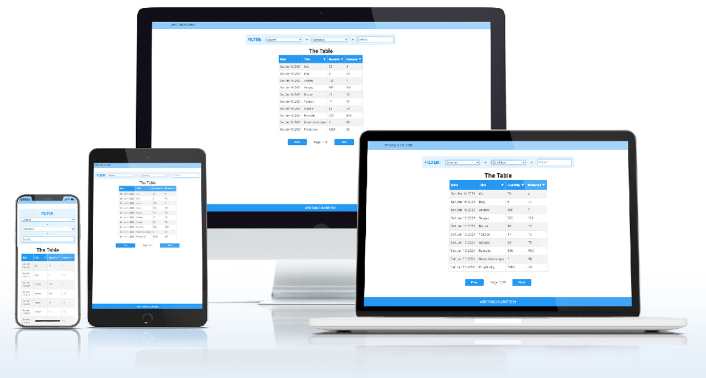

# wbx-table-client. Клиент для <a href="https://github.com/BigPinkRoom/wbx-table-server">wbx-table-server</a>

## <a href="https://wbx-table-client.web.app/">Ссылка на приложение</a>



## Особенности

- Сервер расположен на бесплатном тарифе Heroku, поэтому "засыпает" каждые 30 минут бездействия. Первая загрузка таблицы в клиенте может занять до 15 секунд.

## Функционал

- Сортировка по трём столбцам таблицы - "Title", "Quantity", "Distance".
- Фильтр по трём столбцам таблицы - "Title", "Quantity", "Distance".
  -- Различные варианты фильтрации - полное совпадение, частичное совпадение, больше, меньше.
  -- Фильтрация осуществляется автоматически (задержка - 400ms), при вводе значения в input.
- Пагинация, по 10 столбцов таблицы на страницу.
- Адаптивный дизайн
- Из Vuetify использовались преимущественно сетка и flex. Другой функционал - в единичных случаях.

### При разработке пользовался:

- Vue
- Vuex
- MongoDB
- Vuetify
- SCSS

## Настройка проекта и установка необходимых пакетов

```
npm install
```

### Компиляция и запуск

```
npm run serve
```

### Компиляция и минимизация

```
npm run build
```
